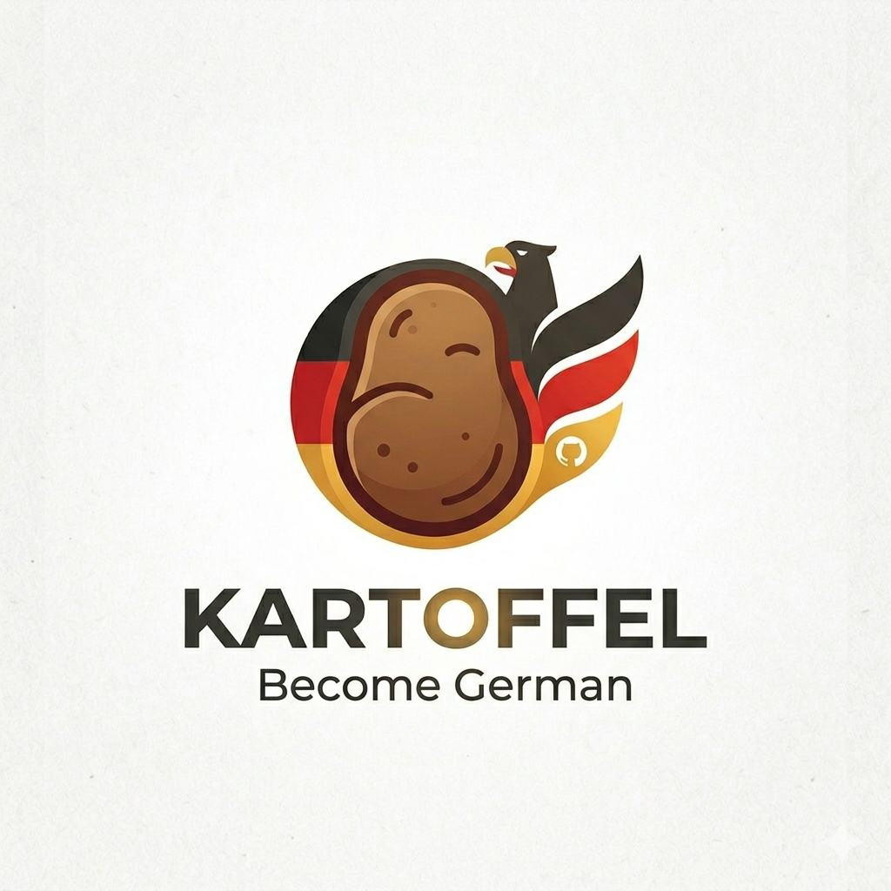

# Kartoffel Project

[](LICENSE)
[](https://codecov.io/gh/cemusta/kartoffel)
[](https://github.com/cemusta/kartoffel)
[](https://cemusta.github.io/kartoffel)
[](https://kartoffel-aa909.web.app/)

<!-- markdownlint-disable MD033 -->
<p align="center">
  
</p>

<p align="center"><b>Become German</b> 🥔</p>
<!-- markdownlint-enable MD033 -->

An application for passing B1 German exam and BurgerTest. Instead of studying somehow I thought writing an app would be more fun.

## Structure

```tree
kartoffel/
├── apps/
│   └── kartoffel-web/       # React web app (mobile-first)
│       └── src/
│           ├── screens/     # Thin wiring layers (hooks → Page props)
│           ├── hooks/       # App-specific hooks (useUser)
│           └── styles/      # Global CSS + MD3 tokens
├── packages/
│   ├── ui-library/          # Presentational component + page library
│   │   ├── src/
│   │   │   ├── components/  # Atoms + Pages (Button, Card, OnboardingPage…)
│   │   │   └── index.ts     # Barrel exports
│   │   └── .storybook/      # Storybook config
│   └── utils/               # Shared helpers (generateUsername, userStorage)
├── package.json             # Root workspace config
└── tsconfig.json            # Shared TypeScript config
```

## Setup

```bash
# Install dependencies
npm install

# Start web app (port 3000)
npm run dev:app

# Build everything
npm run build

# Build web app only
npm run build:app

# Build ui-library only
npm run build:lib

# Lint
npm run lint

# Format
npm run format
```

## Tech Stack

- **Node.js**: v24.14.1
- **TypeScript**: 6.x
- **React**: 19.x
- **React Router**: v7 — URL-based routing
- **Vite**: Build tool + dev server
- **Storybook**: Component + page documentation
- **CSS Modules**: Component styling
- **Material Design 3**: Design token system
- **npm workspaces**: Monorepo management

## Architecture

Pages and screens follow a container/presentational split:

- **Pages** (`packages/ui-library`) — pure presentational, props-only, fully Storybook-able
- **Screens** (`apps/kartoffel-web/src/screens`) — thin wiring: call hooks, pass callbacks to Pages

```tsx
// Page (ui-library) — no hooks, no routing
export function OnboardingPage({ onContinueAnonymous }: OnboardingPageProps) { ... }

// Screen (app) — hooks only, delegates rendering to Page
export function OnboardingScreen() {
  const navigate = useNavigate();
  const { createAnonymousUser } = useUser();
  return <OnboardingPage onContinueAnonymous={() => { createAnonymousUser(); navigate('/home'); }} />;
}
```

## Development

| URL                     | Service   |
| ----------------------- | --------- |
| `http://localhost:3000` | Web app   |
| `http://localhost:6006` | Storybook |

## Storybook

Component library is documented and previewed via Storybook.

```bash
# Start Storybook component explorer (port 6006)
npm run storybook
```

- **Local**: `npm run storybook` → `http://localhost:6006`
- **Live preview**: [cemusta.github.io/kartoffel](https://cemusta.github.io/kartoffel)

## Deployment

Both deployments trigger automatically on every push to `main`.

| Target                       | URL                                                                | Workflow               |
| ---------------------------- | ------------------------------------------------------------------ | ---------------------- |
| **App** (Firebase Hosting)   | [kartoffel-aa909.web.app](https://kartoffel-aa909.web.app/)        | `deploy-firebase.yml`  |
| **Storybook** (GitHub Pages) | [cemusta.github.io/kartoffel](https://cemusta.github.io/kartoffel) | `deploy-storybook.yml` |
